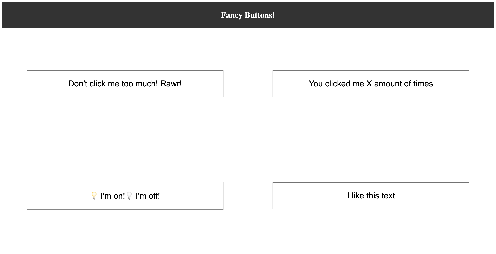
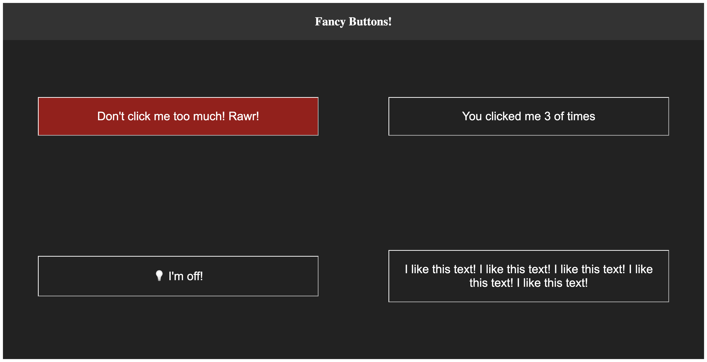
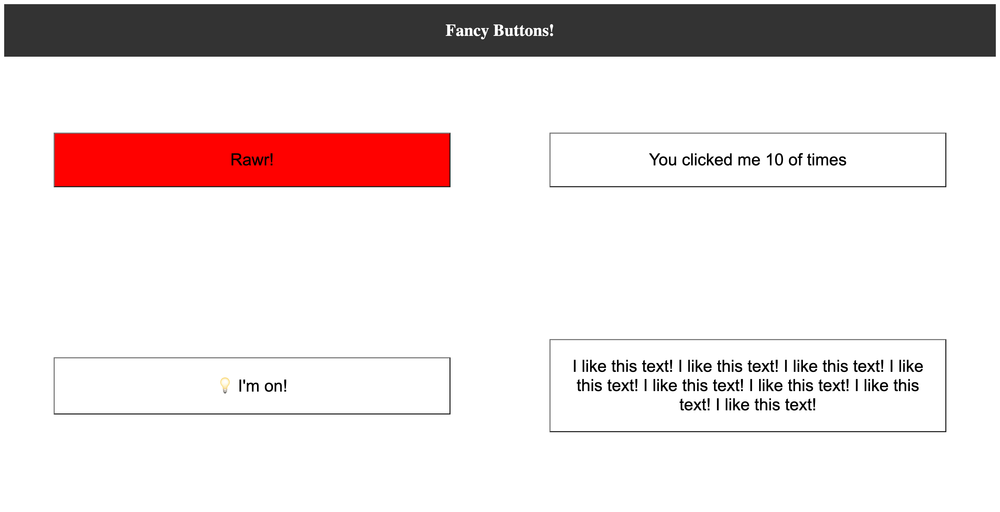

# Fancy-Buttons with Create React App

Practices with creating buttons that will change their state when we interact with them.

Each button will have a specific behavior:

The counter button will keep track how many times we click on it. The angry button will change colour to get more red until it reaches a maximum threshold. The light switch button will turn on and off when clicked. The text repeater button will copy the text of the button over and over.

### ScreenShots

#### Front End Layout

#### Dark Mode

#### Buttons clicked

### Available Scripts

In the project directory, you can run:

### `yarn start`

Runs the app in the development mode.\
Open [http://localhost:3000](http://localhost:3000) to view it in the browser.

The page will reload if you make edits.\
You will also see any lint errors in the console.
